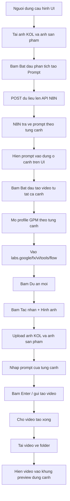

# Script luong chay tab "Che do video voi KOL AI"

## Muc tieu

Xay dung luong tu dong cho tab **"Che do video voi KOL AI"** trong tool AI Video.

Nguoi dung se:

1. Cau hinh thong so ben trai giao dien.
2. Tai anh KOL va anh san pham len tab KOL AI.
3. Bam **"Bat dau phan tich tao Prompt"** de goi API N8N tao prompt theo tung canh.
4. Bam **"Bat dau tao video tu tat ca canh"** de mo tung profile GPM, vao Google Flow, upload anh, nhap prompt, tao video.
5. Video tao xong se duoc tai ve va hien thi dung khung preview cua tung canh tren giao dien tool.

## Du lieu dau vao tren giao dien

### Cau hinh ben trai

Nguoi dung chon cac thong so:

- Danh sach ID Profile: moi dong la 1 `profile_id`.
- Kich thuoc khi mo Profile.
- Duong dan folder lay video.
- Phong cach hinh anh/video.
- Ngon tu kich ban va giong noi.
- Ty le copy tu video goc.
- So canh.
- Giong nhan vat dong nhat.
- Cau hinh VEO3 FLOW:
  - Loai noi dung: `Video`.
  - Loai khung: `Khung hinh` hoac `Thanh phan`.
  - Ty le khung hinh: `9:16` hoac `16:9`.
  - So lan tao: `1x`, `x2`, `x3`, `x4`.
  - Mo hinh AI: `Veo 3.1 - Lite`, `Omni Flash`, `Veo 3.0`, `Veo 2.0`.
  - Thoi gian video: `4s`, `6s`, `8s`, `10s`.

### Cau hinh trong tab "Che do video voi KOL AI"

Nguoi dung tai len:

- `Hinh tham chieu da chieu cua KOL`.
- `Hinh anh san pham`.
- Mo ta them ve KOL AI neu co.

## Luong tong quan



## Buoc 1: Nguoi dung cau hinh dau vao

Nguoi dung thao tac tren giao dien:

1. Chon tab **"Che do video voi KOL AI"**.
2. Nhap danh sach `profile_id` ben trai.
3. Chon so canh.
4. Chon cac thong so Flow:
   - Loai noi dung.
   - Loai khung.
   - Ty le khung hinh.
   - So lan tao.
   - Mo hinh AI.
   - Thoi gian video.
5. Chon file **"Hinh tham chieu da chieu cua KOL"**.
6. Chon file **"Hinh anh san pham"**.
7. Nhap mo ta them ve KOL AI neu can.

### Validate bat buoc

Truoc khi cho chay:

- So `profile_id` hop le phai >= so canh da chon.
- Moi `profile_id` phai dung dinh dang UUID.
- File anh KOL phai ton tai.
- File anh san pham phai ton tai.
- API URL GPM khong duoc rong.
- So canh phai nam trong gioi han tool cho phep.

Neu thieu du lieu, hien thong bao loi tren UI va dung luong.

## Buoc 2: Bam "Bat dau phan tich tao Prompt"

Khi nguoi dung bam nut **"Bat dau phan tich tao Prompt"** trong tab KOL AI:

Tool se goi API N8N bang phuong thuc `POST`.

### Endpoint

Dung endpoint N8N hien tai cua tab KOL AI trong code.

Vi du ten bien co the la:

```python
KOL_AI_PROMPT_WEBHOOK_URL
```

### Method

```http
POST
```

### Du lieu gui len API

Payload can truyen toi thieu:

```json
{
  "mo_ta_them": "...",
  "mo_hinh_sinh_kich_ban": "...",
  "api_key": "...",
  "api_url_trinh_duyet": "...",
  "phien_ban_trinh_duyet": "...",
  "phong_cach": "...",
  "ngon_ngu": "...",
  "ty_le_copy": "...",
  "so_canh": "3",
  "giong_nhan_vat": "...",
  "loai_noi_dung": "Video",
  "loai_khung": "Thanh phan",
  "ty_le_khung_hinh": "9:16",
  "so_lan_tao": "x4",
  "mo_hinh_ai": "Omni Flash",
  "thoi_gian_video": "8s"
}
```

Gui kem file:

- `hinh_tham_chieu_da_chieu_kol`: file anh KOL.
- `hinh_anh_san_pham`: file anh san pham.

### Trang thai nut

Khi request dang chay:

- Doi text nut thanh dang xu ly.
- Disable nut neu can de tranh bam nhieu lan.
- Sau khi request xong thi tra nut ve trang thai ban dau.

## Buoc 3: N8N tra prompt ve UI

Sau khi workflow N8N chay xong, API tra ve danh sach prompt tuong ung voi so canh.

Vi du nguoi dung chon `3` canh thi API phai tra ve 3 prompt.

### Dinh dang response chap nhan

Tool nen ho tro cac dang pho bien:

```json
{
  "prompt_1": "Noi dung prompt canh 1",
  "prompt_2": "Noi dung prompt canh 2",
  "prompt_3": "Noi dung prompt canh 3"
}
```

Hoac:

```json
[
  {
    "scene": 1,
    "prompt": "Noi dung prompt canh 1"
  },
  {
    "scene": 2,
    "prompt": "Noi dung prompt canh 2"
  },
  {
    "scene": 3,
    "prompt": "Noi dung prompt canh 3"
  }
]
```

### Gan prompt vao UI

Mapping:

- `prompt_1` hien vao o prompt cua **Canh 1**.
- `prompt_2` hien vao o prompt cua **Canh 2**.
- `prompt_3` hien vao o prompt cua **Canh 3**.
- Tiep tuc theo so canh da chon.

Neu API tra ve thieu prompt:

- Hien canh bao.
- Khong tu dong tao video khi prompt chua du.

Neu API tra ve nhieu prompt hon so canh:

- Chi lay so prompt bang so canh da chon.

## Buoc 4: Bam "Bat dau tao video tu tat ca canh"

Sau khi moi canh da co prompt, nguoi dung bam:

**"Bat dau tao video tu tat ca canh"**

Tool se:

1. Lay so canh da chon.
2. Lay danh sach `profile_id`.
3. Lay prompt cua tung canh tren UI.
4. Tao thread rieng cho tung canh.
5. Moi thread mo 1 profile GPM tuong ung.

### Mapping canh voi profile

Vi du:

- Canh 1 dung `profile_id` dong 1.
- Canh 2 dung `profile_id` dong 2.
- Canh 3 dung `profile_id` dong 3.

### Du lieu truyen vao moi thread

Moi thread can co:

```python
{
    "scene_index": 1,
    "profile_id": "...",
    "prompt_text": "...",
    "kol_reference_image_path": "...",
    "product_image_path": "...",
    "save_dir": "...",
    "flow_settings": {
        "content_type": "Video",
        "frame_type": "Thanh phan",
        "aspect_ratio": "9:16",
        "gen_count": "x4",
        "ai_model": "Omni Flash",
        "duration": "8s"
    }
}
```

## Buoc 5: Mo Google Flow va bam "Du an moi"

Moi profile GPM se mo trang:

```text
https://labs.google/fx/vi/tools/flow
```

Sau khi trang load:

1. Neu co popup/cookie/intro thi dong neu can.
2. Tim nut **"Du an moi"**.
3. Click nut **"Du an moi"**.
4. Doi vao trang project moi.

### Selector goi y cho Playwright

```python
page.goto("https://labs.google/fx/vi/tools/flow", wait_until="domcontentloaded", timeout=60000)
page.get_by_text(re.compile(r"Dự án mới|Du an moi|New project|New", re.I)).click(timeout=30000)
```

Can co fallback neu ngon ngu UI thay doi.

## Buoc 6: Upload anh va nhap prompt trong project moi

Sau khi vao project moi:

1. Kiem tra trong khu vuc prompt da co dau **"+"** hay chua.
2. Neu da co dau **"+"** thi bam dau **"+"** luon, bo qua buoc bam **"Tac nhan"**.
3. Neu chua thay dau **"+"** thi moi bam **"Tac nhan"** o khu vuc prompt, sau do bam dau **"+"** vua hien ra.
4. Chon **"Hinh anh"**.
5. Upload file **"Hinh tham chieu da chieu cua KOL"**.
6. Upload file **"Hinh anh san pham"**.
7. Cho ca 2 anh upload xong va hien trong prompt.
8. Nhap prompt cua canh tuong ung vao o prompt.
9. Bam `Enter` hoac nut gui.
10. Doi den khi video tao xong.

### Selector goi y

Uu tien click dau cong trong khu vuc prompt truoc:

```python
def click_prompt_plus(page):
    # Uu tien dau + nam o vung prompt phia duoi man hinh,
    # tranh click nham dau + tren thanh top bar.
    return page.evaluate("""
        () => {
            const viewportHeight = window.innerHeight || document.documentElement.clientHeight || 0;
            const candidates = Array.from(document.querySelectorAll('button, [role="button"]'));
            const visible = candidates
                .map((el) => {
                    const rect = el.getBoundingClientRect();
                    const text = (el.innerText || el.textContent || '').trim();
                    const aria = (el.getAttribute('aria-label') || '').trim();
                    const title = (el.getAttribute('title') || '').trim();
                    const label = `${text} ${aria} ${title}`;
                    return {el, rect, label};
                })
                .filter((item) => {
                    const style = window.getComputedStyle(item.el);
                    if (style.visibility === 'hidden' || style.display === 'none') return false;
                    if (item.rect.width <= 0 || item.rect.height <= 0) return false;
                    if (item.rect.bottom < 0 || item.rect.top > viewportHeight) return false;
                    return /(^|\\s)\\+(\\s|$)|Add|Them|Thêm/i.test(item.label);
                });
            const promptArea = visible
                .filter((item) => item.rect.top > viewportHeight * 0.45)
                .sort((a, b) => b.rect.top - a.rect.top || a.rect.left - b.rect.left);
            const target = promptArea[0] || visible.sort((a, b) => b.rect.top - a.rect.top)[0];
            if (!target) return false;
            target.el.scrollIntoView({block: 'center', inline: 'center'});
            target.el.click();
            return true;
        }
    """)
```

Chi click Tac nhan neu chua thay dau cong:

```python
if not click_prompt_plus(page):
    page.get_by_text(re.compile(r"Tác nhân|Tac nhan|Agent", re.I)).click(timeout=10000)
    click_prompt_plus(page)
```

Selector dau cong fallback neu can:

```python
page.locator('button:has-text("+"), [aria-label*="Add"], [aria-label*="Thêm"]').last.click(timeout=10000)
```

Sau khi bam dau cong, uu tien upload truc tiep bang file input neu Flow da tao san input:

```python
file_input = page.locator('input[type="file"]').last
file_input.set_input_files(kol_reference_image_path)
```

Neu chua co file input thi moi click Hinh anh bang file chooser:

```python
with page.expect_file_chooser(timeout=8000) as fc_info:
    page.get_by_text(re.compile(r"Hình ảnh|Hinh anh|Image", re.I)).click(timeout=10000)
fc_info.value.set_files(kol_reference_image_path)
```

Upload file:

```python
file_input = page.locator('input[type="file"]').last
file_input.set_input_files([kol_reference_image_path, product_image_path])
```

Neu UI chi cho upload tung file:

```python
file_input.set_input_files(kol_reference_image_path)
# lap lai thao tac bam + / Hinh anh
file_input.set_input_files(product_image_path)
```

Nhap prompt:

```python
prompt_box = page.locator('textarea:visible, div[contenteditable="true"]:visible').last
prompt_box.fill(prompt_text)
prompt_box.press("Enter")
```

Neu `Enter` xuong dong thay vi gui:

```python
prompt_box.press("Control+Enter")
```

## Buoc 6.1: Cau hinh Flow truoc khi gui prompt

Truoc khi bam gui tao video, can mo menu cau hinh Flow va chon cac thong so:

- Loai noi dung.
- Loai khung.
- Ty le khung hinh.
- So lan tao.
- Mo hinh AI.
- Thoi gian video.

### Gia tri vi du

```python
flow_settings = {
    "content_type": "Video",
    "frame_type": "Thanh phan",
    "aspect_ratio": "9:16",
    "gen_count": "x4",
    "ai_model": "Omni Flash",
    "duration": "8s"
}
```

### Logic click

1. Mo menu cau hinh.
2. Click dung text tung setting.
3. Neu khong tim thay setting thi log canh bao, khong crash ngay.

Goi y:

```python
def click_setting(value):
    pattern = re.compile(rf"^\s*{re.escape(value)}\s*$", re.I)
    page.get_by_text(pattern).last.click(timeout=3000)
```

## Buoc 6.2: Doi video tao xong

Sau khi gui prompt:

1. Doi trang bat dau render.
2. Theo doi progress/loading.
3. Neu co thong bao loi thi emit loi ve UI.
4. Khi video render xong, tim video moi nhat.
5. Lay URL video hoac blob video.
6. Tai video ve folder da chon.

### Timeout

- Timeout mac dinh: 5 den 10 phut moi canh.
- Neu qua timeout thi bao loi canh do, khong lam dung toan bo tool neu cac canh khac van dang chay.

### Ten file video

Dat ten file theo canh:

```text
kol_ai_scene_001.mp4
kol_ai_scene_002.mp4
kol_ai_scene_003.mp4
```

Neu can tranh trung:

```text
kol_ai_scene_001_YYYYMMDD_HHMMSS.mp4
```

## Buoc 7: Hien video ve dung khung tren giao dien

Sau khi video cua tung canh duoc tai ve:

1. Emit signal ve UI:

```python
record.emit(scene_index, "Tai video thanh cong", video_path)
```

2. UI nhan signal va update dung khung preview cua canh do.
3. Khung preview canh do doi text/thumbnail thanh video da tai xong.
4. Khi click vao khung preview thi mo file video tuong ung.

### Mapping preview

- Video canh 1 hien vao preview box **SCENE 1**.
- Video canh 2 hien vao preview box **SCENE 2**.
- Video canh 3 hien vao preview box **SCENE 3**.

Dung `scene_index` de map, khong map theo thu tu thread hoan thanh vi thread co the xong khac thu tu.

## Trang thai UI can co

### Khi dang phan tich prompt

- Nut **"Bat dau phan tich tao Prompt"** doi thanh dang xu ly.
- Khong cho bam lap nhieu lan.

### Khi dang tao video

- Nut **"Bat dau tao video tu tat ca canh"** doi thanh dang xu ly.
- Hien so canh dang xu ly.
- Moi canh co trang thai rieng:
  - Dang mo GPM.
  - Dang vao Google Flow.
  - Dang upload anh.
  - Dang nhap prompt.
  - Dang tao video.
  - Dang tai video.
  - Hoan thanh.
  - Loi.

### Khi bam dung

- Dung tat ca thread.
- Dong cac profile GPM dang mo neu co the.
- Reset UI ve trang thai ban dau.

## Loi can xu ly

### Loi dau vao

- Thieu profile ID.
- Profile ID sai dinh dang.
- Thieu anh KOL.
- Thieu anh san pham.
- Thieu prompt cho canh.
- Thieu API URL GPM.

### Loi N8N

- API timeout.
- API tra ve HTTP error.
- API tra ve JSON sai dinh dang.
- API tra ve thieu prompt.

### Loi GPM / Browser

- Khong mo duoc profile.
- Khong connect duoc CDP.
- Trang Google Flow load cham.
- Bi bat login Google.
- UI Google Flow doi ngon ngu/doi layout.

### Loi upload / render

- Upload anh that bai.
- Khong tim thay nut Tac nhan.
- Khong tim thay nut Hinh anh.
- Khong tim thay o prompt.
- Render video qua timeout.
- Khong tim thay video output.
- Tai video that bai.

## Yeu cau quan trong khi code

1. Khong hard-code theo toa do chuot neu co the dung selector.
2. Moi selector can co fallback tieng Viet va tieng Anh.
3. Moi canh chay doc lap theo `scene_index`.
4. Khong de canh xong truoc ghi nham vao khung cua canh khac.
5. Log ro tung buoc theo dang:

```text
[KOL AI - Canh 1] Dang mo GPM
[KOL AI - Canh 1] Dang vao Google Flow
[KOL AI - Canh 1] Dang upload anh KOL
[KOL AI - Canh 1] Dang upload anh san pham
[KOL AI - Canh 1] Dang nhap prompt
[KOL AI - Canh 1] Dang tao video
[KOL AI - Canh 1] Tai video thanh cong: path...
```

6. Neu mot canh loi, bao loi canh do va tiep tuc theo doi cac canh khac.
7. Khi toan bo canh hoan thanh hoac loi/dung, tra nut ve trang thai ban dau.

## Acceptance checklist

Luot test duoc coi la thanh cong khi:

- Chon 3 canh va 3 profile ID.
- Upload duoc anh KOL va anh san pham len tool.
- Bam **"Bat dau phan tich tao Prompt"** thi request N8N thanh cong.
- N8N tra ve 3 prompt.
- 3 prompt hien dung vao 3 canh tren UI.
- Bam **"Bat dau tao video tu tat ca canh"** thi mo dung 3 profile.
- Moi profile vao duoc Google Flow.
- Moi profile bam duoc **"Du an moi"**.
- Moi profile upload duoc 2 anh vao prompt.
- Moi profile nhap dung prompt cua canh tuong ung.
- Moi profile tao xong video.
- Moi video hien dung vao khung preview cua tung canh.
- Click vao khung preview mo duoc video da tai.

## Ghi chu trien khai

File co lien quan trong code hien tai:

- `giaodientoolmau_videoai.py`: Manager UI, luong Veo3, xu ly prompt va preview.
- `kie_ai_auto.py`: luong rieng cho tab KOL AI.
- `tool_video_ai_layout_3_UI.py`: layout giao dien.
- `GpmGlobalApi_tuviet.py`: goi API GPM Global.

Nen uu tien trien khai luong KOL AI trong `kie_ai_auto.py`, vi file nay da duoc tach rieng cho tab **"Che do tao video voi KOL AI"**.
